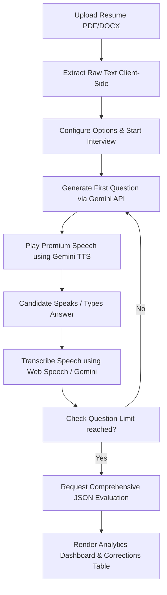

# AI Resume Interview Coach 🚀

An interactive, real-time AI mock interview training application. It analyzes your PDF, DOCX, or TXT resume and generates customized, context-aware follow-up questions tailored specifically to your background, experience, and projects. It uses premium humanized Text-to-Speech (TTS) and resilient transcription to simulate a natural, professional interview flow.

---

## 💡 The Core Idea

Typical mock interview tools ask generic questions (e.g., *"What are your strengths?"*). This application **acts like a real human recruiter**. 

1. **Resume-First Focus**: It reads your exact resume (parsing skills, projects, and roles).
2. **Context-Aware Follow-ups**: The AI references specific elements on your resume (e.g., asking how you optimized database latency or built a Hadoop cluster).
3. **Conversational Loop**: You speak or type your answers, the AI listens, transcribes your voice, registers the content, and dynamically formulates the next question, building a continuous dialogue.
4. **Actionable Performance Metrics**: At the end, instead of a simple grade, it constructs a complete interactive dashboard detailing exact filler word counts, grammar errors, confidence levels, and polished phrase corrections.

---

## ✨ Key Features

- 👤 **Resume Parsing**: Direct support for uploading `.pdf`, `.docx`, and `.txt` files with client-side text extraction.
- 🎨 **Premium Glassmorphic UI**: Beautiful responsive grid layout featuring modern dark/light mode toggles and an interactive audio sound wave visualizer.
- 🗣️ **Premium Human TTS**: Integrated with Gemini's high-fidelity conversational audio synthesis (locked to the realistic, professional **Gemini Premium: Kore** voice).
- 🎙️ **Resilient Transcription**: Double-fallback voice transcription handler (supports Chrome's Web Speech API and falls back to serverless `audio/webm` chunk parsing via Gemini models).
- ⚙️ **API Quota Management**: Toggleable **"Real-time voice rendering"** option to preserve Google AI Studio Free Tier limits by transcribing locally and querying the API only on final submissions.
- 📊 **Performance Analytics Dashboard**: Upgraded report card featuring:
  - **Overall Score** card.
  - **Grammar & Vocabulary** indicator.
  - **Confidence Rate** pacing analyser.
  - **Filler Word Count** tracker (flags *"um"*, *"uh"*, *"like"*, *"basically"*).
  - **Correction Table**: Shows exactly which phrases you spoke, maps professional corrections, and provides detailed impact explanations.
- 📤 **Downloadable Reports**: Clean `.txt` exporter to download your full interview transcript and analytical report card locally.

---

## 🛠️ How It Works (Technical Flow)

The application utilizes a purely client-side front-end logic powered by a Python development server:



1. **Text Extraction**: The app parses PDFs via `pdf.js` and DOCX files via `Mammoth.js` directly in the browser.
2. **Dynamic Prompting**: It compiles your resume text and selection mode (Friendly, Realistic, or Pressure) into a structured prompt, guiding Gemini to generate custom follow-up questions.
3. **High-Availability TTS**: It loops over a model failover pool (`gemini-2.5-flash`, `gemini-2.5-flash-lite`, `gemini-1.5-flash`, etc.) to synthesize audio blocks, falling back silently to the browser's speech synthesizer if the API key hits a rate limit.
4. **Filler & Grammar Parsing**: Cleans speech patterns, highlights filler terms, and utilizes JSON modal structures to map grammar errors to corresponding correction phrases.

---

## 📈 Why It Is Useful

- **Targeted Practice**: Simulates real-world interviewer behavior—they will grill you on the details of your projects (like Hadoop pipelines or predictive models).
- **Filler Word Elimination**: Visually shows you how many times you say *"like"*, *"um"*, or *"basically"*, training you to speak with professional confidence.
- **Immediate Polishing**: The corrections table gives you ready-to-use professional alternatives for your answers.
- **API Savings**: Optimized code ensures you can run full, high-fidelity mock interviews completely on a free-tier Google AI Studio API key without running out of quota.

---

## 🚀 Running Locally

### Prerequisites
- Python 3.x installed.
- A Google Gemini API Key (Get one from [Google AI Studio](https://aistudio.google.com/)).

### Steps

1. **Clone the Repository**:
   ```bash
   git clone https://github.com/Suraj76450/resume-interview-ai.git
   cd resume-interview-ai
   ```

2. **Start the Local Development Server**:
   You can start the server by double-clicking the `start-server.bat` script on Windows, or by running:
   ```bash
   python server.py
   ```

3. **Open the Application**:
   Open your browser and navigate to **`http://localhost:4173`** (or **`http://127.0.0.1:4173`**).

4. **Start Mock Interviewing**:
   - Paste your Gemini API key in the sidebar panel.
   - Upload your resume file.
   - Choose your interview mode, question count, and click **Start Interview**.

---

## 📁 Codebase Tour

- `/index.html`: Holds the application structure, settings sidebar, sound wave canvas, chat bubbles, and the modal dashboard layout.
- `/css/style.css`: Contains custom variables, grid styling, dark/light theme definitions, and keyframe animations for voice waves.
- `/js/app.js`: Configures the main application logic:
  - Speech synthesis and transcription loops.
  - Gemini model rotation and rate limit failovers.
  - Form validations, resume parsers, and dashboard renderer.
